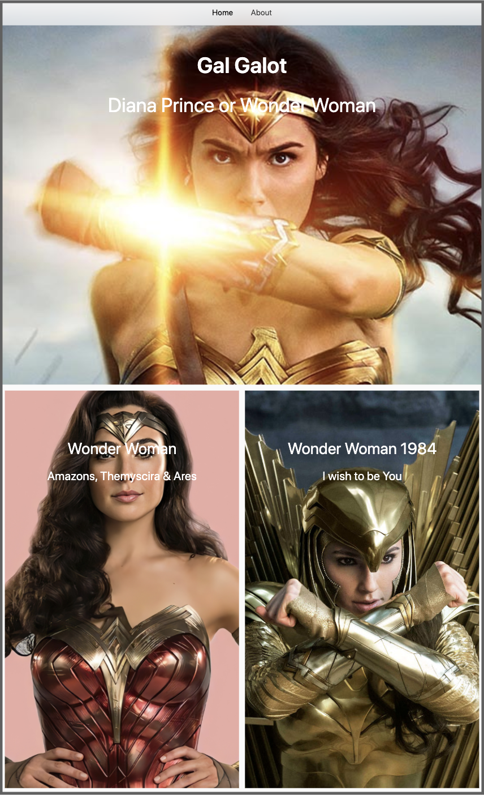
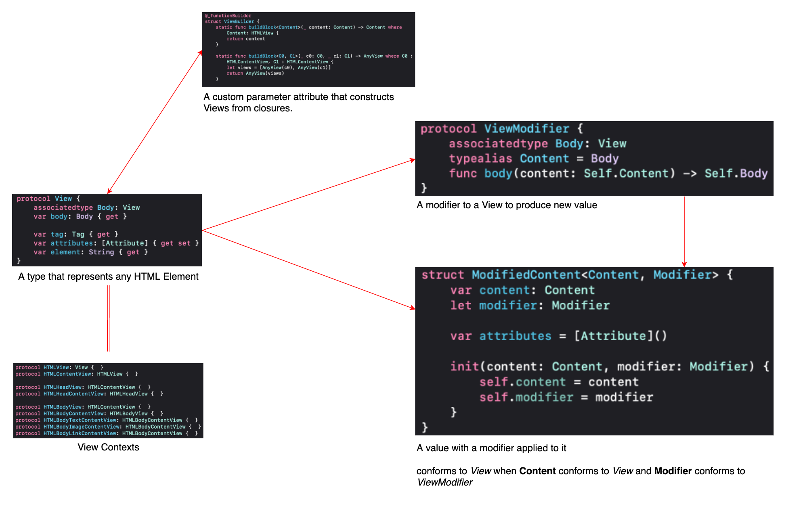

# HTMLDSL

## What's a DSL:
It stands for Domain Specific Language.

Purpose: DSL solves a particular problem for everyone even for the ones with very little knowledge on a particular domain.  

If you are an Apple Developer, then you would probably know about `Podfile` which is a DSL written in Ruby.  

Here we are trying to build one for HTML in Pure Swift which we all love.

## Features:
✅ Unit Tested

✅ Experience SwiftUI like Syntax

✅ Type Safety

✅ Auto Completion

✅ Compile Time Error

✅ Easy to Read & Debug

✅ Create Websites without any knowledge of HTML, in pure Swift

## Currently Supports:

### Elements:
- Document
- HTML
- Head
    - Title
    - Meta
    - External Style
    - Internal Style
- Body
    - Headings
    - Paragraphs
    - Image
    - Link with Text & Image
    - Div
    - IFrame
    - Inline Style
### Attributes:
- id, CSS Class
- Margin, Padding, Box Sizing
- Position, Edge Constraints
- Transform
- Background Color, Foreground Color
- Width, Height
- Font Sizes, Web Safe Font Families, Font Weight
- Text Alignment, Text Formatting, Text Decoration
- Target for Links
- Filter
- Display
- Background Image, Background Position, Background Repeat, Background Size
- zIndex
- Grid: Column Gap, Template Columns
- Flex: Direction, Align along the Axis, Distribute along cross Axis

## Example:
```
let index = Document {
    HTML {
        Head {
            Title("Wonder Woman")
            Meta([.characterSet(.utf8),
                  .name(.author, content: "Shahrukh Alam")])
            CSSLink(path: "CSS/Common/nav.css")
            CSSLink(path: "CSS/Index/hero.css")
            CSSLink(path: "CSS/Index/grid.css")
            HeadStyle {
                IndexBodyStyle()
            }
        }
        
        Body {
            Div {
                Link(text: "Home", url: "index.html")
                    .identifyBy(cssClass: .activeLink)
                Link(text: "About", url: "about.html")
                    .identifyBy(cssClass: .inactiveLink)
            }
            .identifyBy(cssClass: .indexNav)
            
            Hero(detail: Detail(title: "Gal Galot",
                                subtitle: "Diana Prince or Wonder Woman",
                                image: "Images/wonder1.jpg"))
            
            Grid(details: [Detail(title: "Wonder Woman",
                                  subtitle: "Amazons, Themyscira & Ares",
                                  image: "Images/wonder2.jpg"),
                           Detail(title: "Wonder Woman 1984",
                                  subtitle: "I wish to be You",
                                  image: "Images/wonder3.jpeg")])
        }
    }
}
```
Above code generates below HTML Page:



## Architecture:
It's pretty similar to SwiftUI's Architecture, but for HTML Views or Elements.



## Better Picture:
To get the feel of it, you may checkout [my portfolio](https://shahrukhalam.github.io/portfolio/) which is entirely generated by this HTMLDSL.

## In Pipeline:
- Automate generation of HTML using CLT
- Proper Indentation
- Use CDN if needed
